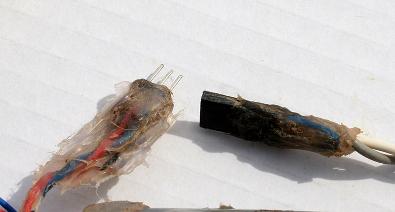

# Collar luminoso para Norma

Otro gadget para Norma.

Esta vez, un collar luminoso que cambia de color en función de su nivel de actividad. 

La función principal es tenerla localizada visualmente y hacerla visible a los demás durante los paseos nocturnos que tanto le gustan. 

Pero también es una forma de conocer de manera bastante aproximada su nivel de actividad en cada momento.

      
**https://t.me/normalaperra**

## El montaje es muy sencillo. 

 

Solo unas pocas soldaduras siguiendo el esquema y tratar de impermeabilizar el conjunto tanto como sea posible. Hay que tener en cuenta que Norma es una Husky que ama el agua. 

Para ello, introduciremos la tira de leds en el tubo de plástico para protegerlo de posibles daños y taparemos los extremos con silicona caliente para impermeabilizarlo. Hay que decir que se trata de un collar que Norma lleva varios años utilizando y que nos ha sido muy útil. También es cierto que su afición tanto por los baños de agua dulce como salada la ha puesto a prueba en más de una ocasión, a veces con resultados negativos para el collar... 

Al principio la forma de proteger el circuito electrónico era una pequeña caja de plástico, pero siempre terminaba rompiéndose de una forma u otra. 
Finalmente se optó utilizar otras trozos de tubo de plástico para proteger el acelerometro y al propio Arduino Nano.

 

Otra de las partes más dañadas sucesivamente fue el microinterruptor, por lo que al final optamos por un pequeño conector que debe ser conectado cada vez que se usa (ver foto). Es cierto que en otro tipo de mascota menos activa, una simple caja de plástico como las primeras versiones con un interruptor encendido para conexión y desconexión, sería más que suficiente.

 

Cuando se conecta la alimentación, el collar muestra el nivel de batería restante por medio de los primeros 10 LED. 
Para facilitar la lectura de un vistazo, los primeros 5 serán azules, los tres siguientes (correspondientes al 60, 70 y 80 por ciento) serán de color amarillo anaranjado y los dos últimos (correspondientes al 90% y 100%) serán verdes.
Luego realiza un test de los leds mostrando disitintos patrones y colores. 

 

## Durante su modo de funcionamiento el comportamiento es el siguiente: 

si Norma esta quieta, se mostrará **COLOR ROJO.**

Si hay un nivel de actividad moderado, por ejemplo, caminar o moverse ligeramente, se mostrará **COLOR VERDE.**

En caso de actividad intensa, como correr, el collar mostrará **COLOR ROSA.**

Si hay cambios bruscos de dirección o saltos, se mostrará un patrón rotatorio con los COLORES DEL **ARCO IRIS.**

Dado que la intensidad del brillo y algunos patrones de color cambian a medida que se agota la batería, cada vez que hay un cambio en el nivel de la batería que afecta la forma de mostrar los colores, se mostrará un breve parpadeo azul seguido del nivel de la batería durante unos segundos, y luego se reanuda nuevametne el funcionamiento normal, mostrando colores dependiendo de los niveles de actividad.

Una función añadida después de algún tiempo de uso ha sido la función de **baliza** en caso de que se perdiera el collar, (lo que ha sucedido en un par de ocasiones). 

En caso de que el acelerómetro deje de medir la actividad durante un cierto período de tiempo, Arduino entra en modo de **SLEEP** para cambiar a baja consumo. En este modo, en lugar de que todos los LED permanezcan encendidos en un color fijo (dependiendo del nivel de actividad), lo que se muestra es un parpadeo con un cierto patrón (alternando los LED utilizados), por lo que la duración de la batería aumenta considerablemente. 

Esto nos permite buscarlo incluso la noche después de que se pierda, ya que la batería puede durar mucho más de 24 horas. 

Sería muy raro que Norma permaneciera completamente quieta el tiempo suficiente para activar el modo **Baliza**, pero podría suceder... 

En ese caso, el collar vuelve a su modo de funcionamiento normal solo si la actividad se reanuda y se mantiene durante al menos unos minutos. De esta forma, evitamos que un error de lectura del acelerómetro pueda reactivar el collar si se pierde y esta activo el modo **baliza.**

 

 

 

